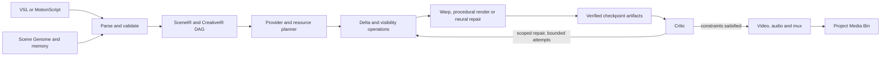

# VSL and Neural Scene Runtime: technical specification 0.1

Status: proposed architecture and implementation contract, not an implemented neural generator.

Repository baseline inspected: `origin/main` at `d652066ce428e4f128514da4d1caee919974554e`, Android 3.4.7. The working checkout contains earlier local preview changes; this specification does not merge, reset or replace them. Supplied phone screenshots are observations, not a live device connection.

## 1. Objective and limits

Represent a scene persistently, compile requested changes into explicit operations, reuse verified artifacts, and reconstruct pixels at rendering boundaries. Neural inference is a provider invoked when necessary, rather than the implicit owner of every frame.

The efficiency hypothesis is measurable: scene reuse and selective reconstruction may reduce inference, memory traffic and repeated analysis. It does not establish a particular speedup, a 14% changed area, or photorealistic quality on a phone. Camera movement can change almost every screen pixel; reflections, shadows and cloth can affect regions far beyond the moved object. A model may still require full-frame context even when its output is a small masked region. Measure these costs separately.

Required properties:

- Every completed operation has an executable implementation and verified output.
- Semantic identity preservation is a constraint to validate, not a guarantee obtained by copying an embedding.
- Unknown content stays explicitly unknown until observed, reconstructed or generated with provenance.
- Projects, generation inputs and verified checkpoints survive process death.
- Missing models produce capability diagnostics, never substitute unrelated title cards or silently discard constraints.
- No paid inference dependency, Gallery enumeration, unrestricted script execution or hidden upload is introduced.

## 2. Integration baseline

| Existing component | Reuse in this design | Present limitation |
|---|---|---|
| `MotionScriptCompiler` | Existing frontend and CreativeIR 0.2 compatibility | Current parser does not accept the proposed VSL syntax |
| `CreativeJobGraph` | Capability DAG, dependencies, provider/resource metadata | Whole-node planning; no verified region/time-level neural executor |
| `CreativeNodeStore` | Checkpoints and downstream invalidation | Needs artifact validation and region/time scopes |
| `CreativeWorkspace` | Project storage and portable artifact areas | Needs Scene Pack transactions and content-addressed references |
| `CapabilityRegistry` / `ModelPackManager` | Provider discovery and verified pack lifecycle | Installed manifests alone do not prove execution |
| `DeviceComputeProfile` / `JobManager` | Hardware observations and thermal/memory waiting | Budget estimates need per-provider measurement and admission checks |
| `NativePortraitMotionAnalyzer` / `AnimatedSceneDirector` | Segmentation, face-aware layered portrait motion | No established face embedding, full body synthesis or learned flow |
| `ProceduralScene` / `LocalSceneDirector` | Animated geometry and procedural scene construction | Procedural rendering is not photorealistic neural synthesis |
| `NativeRenderEngine` | Media3 export boundary | Device codec negotiation and independent audio recovery are required |
| `NativeRenderCritic` | Decode, exposure, freeze-like spans and luminance checks | Does not establish semantic face/finger/cloth correctness |
| `src/studio-temporal.js` (latest main) | RAFT ONNX anchor-frame flow and mesh interpolation in Studio Web | Browser runtime; no verified native Android RAFT adapter |
| `src/studio-cinematic.js` (latest main) | Cinematic Worlds perspective portal compositor, translation tracking and optional foreground segmentation | Browser runtime; not a persistent reconstructed 3D world |
| `src/studio-neural.js` (latest main) | SD-Turbo/ONNX Runtime WebGPU keyframe execution path | Large optional downloads, model licence restrictions, unverified device execution |
| `src/studio-runtime.js` (latest main) | Explicit Studio Web action dispatch and browser-local asset persistence | Browser job/recording lifetime differs from native durable service lifetime |

An initial search scoped to Android and documentation missed the newer Studio Web sources. A subsequent full-tree search confirmed both existing modules. Reuse them; do not create duplicate modules under the same names. Source inspection confirms inference/compositing execution paths, not successful model download, inference or recording on the user's phone. Their model weights are not bundled in this checkout. Source comments describing model licences are provenance leads; verify the actual distributed weights' licences before activation.

Inspected source: [RAFT temporal module](https://github.com/RezoxNemesis/VideoStudio-MCP/blob/d652066ce428e4f128514da4d1caee919974554e/src/studio-temporal.js) and [Cinematic Worlds compositor](https://github.com/RezoxNemesis/VideoStudio-MCP/blob/d652066ce428e4f128514da4d1caee919974554e/src/studio-cinematic.js), pinned to the baseline above.

Every plan declares `runtimeTarget: android_native | studio_web`. Do not silently switch a native request to browser execution. Shared Scene Pack contracts can connect the runtimes, but asset IDs, storage grants and provider availability are target scoped. Cross-target transfer needs an explicit existing authorised transfer path and verified receipt; browser IndexedDB data does not automatically exist in the native SQLite project.

## 3. Language and compatibility

VSL is a versioned, deterministic scene language. It is a new frontend over the existing CreativeIR/runtime architecture, not a competing project store. Preserve MotionScript 0.2 and MCP v3. Add `language: "vsl"` and `languageVersion: "0.1"` to future compile requests; absence keeps existing MotionScript interpretation.

The first VSL frontend accepts declarations, typed constants, bounded motion tracks and declarative policies. No loops, recursion, user functions, filesystem paths, network calls or arbitrary expressions. Source references resolve only to explicitly authorised project assets. Compiler errors carry code, source span, entity ID and missing capability.

### Primitives

| Primitive | Type and semantics |
|---|---|
| Identity | Reference asset hashes, immutable constraints, optional provider-specific descriptors |
| Object/subject | Stable entity ID, parent, geometry/rig references and semantic regions |
| Depth | Map or geometry reference, coordinate space, confidence and metric/relative scale |
| Motion | Typed pose/transform/deformation track over rational time |
| Camera | Intrinsics, extrinsics and bounded trajectory; world metres require calibrated scale |
| Material | Texture, roughness, deformation law and appearance constraints |
| Light | Position/direction, colour and intensity with declared units |
| Time | Integer ticks plus rational timebase; intervals are half-open |
| Physics | Explicit solver/provider, units, boundary conditions and deterministic step size |
| Uncertainty | Validity, visibility and calibrated error evidence per region/time; not one model score |
| Generate | Output capability, permitted repair region, context requirement and provenance |
| Critique | Measured constraints, thresholds, repair permissions and bounded attempts |

World coordinates are right-handed: +X right, +Y up, camera forward -Z. Screen coordinates use top-left origin, +X right, +Y down. Flow vectors are source-to-target pixel displacements unless explicitly converted. Every camera, map and provider declares its space and conversion. Input colour space and transfer function are explicit; compositing uses linear light. Output conversion is recorded.

Minimal grammar shape:

```ebnf
program      = "vsl", version, "scene", identifier, "{", declaration*, "}" ;
declaration  = asset | subject | camera | material | light | shot | generate | critique | output ;
asset        = "asset", identifier, "=", "project_asset", "(", string, ")", ";" ;
subject      = "subject", identifier, "{", subject_property*, "}" ;
shot         = "shot", identifier, time, "..", time, "{", motion_property*, "}" ;
quantity     = finite_number, unit ;
time         = nonnegative_number, "s" ;
identifier   = letter, (letter | digit | "_")* ;
```

The grammar is a proposed frontend contract. Property keys have an allowlist; units and enums are type checked. Unknown identifiers, unknown keys, duplicate entity IDs, NaN/infinite values, incompatible units and invalid intervals fail compilation. Physical units do not become arbitrary screen-space offsets when calibration is absent.

### Illustrative authoring example — not accepted by the current app

```vsl
vsl 0.1 scene RiverPortrait {
  asset reference_1 = project_asset("portrait_asset_id");
  subject A {
    reference = reference_1;
    identity = reference_locked;
    preserve = [face, clothing, body_shape];
    representation = layered_portrait;
  }
  camera main {
    space = reference_relative;
    projection = perspective;
  }
  material A.clothing {
    wind_direction = [1, 0, 0];
    wind_speed = 0.7mps;
    turbulence = 0.22;
    solver = cloth_region;
  }
  shot turn 0s..4s {
    pose A.head = turn_yaw(18deg, 1.3s);
    camera main = orbit_right(12deg, 4s);
  }
  generate {
    policy = changed_regions;
    missing_provider = error;
    temporal_consistency = strict;
  }
  critique {
    max_repairs = 2;
    unmet_constraint = stop_with_diagnostics;
  }
  output {
    canvas = [1080, 1920];
    fps = 30;
    duration = 4s;
    audio = none;
  }
}
```

This request can fail honestly: an unseen side of a face and a physically meaningful cloth motion require suitable reconstruction/pose/cloth providers. A face-aware camera anchor is not a head-turn synthesizer. The first executable slice must use the subset its installed providers actually support.

## 4. Compiler and execution stages

1. **Parse:** bounded source into an AST with source spans. Proposed initial limits: 64 KiB source, 128 entities, 256 tracks and 10,000 logical nodes; limits are configurable only after benchmark evidence.
2. **Resolve:** bind project assets, immutable content hashes, entity IDs and Scene Genome revision. Missing/deleted inputs fail.
3. **Type check:** units, spaces, timeline intervals, identity/visibility constraints, materials and output requirements.
4. **Lower:** emit versioned SceneIR for entities and tracks plus a CreativeIR operation DAG. Retain source-to-node mappings. Do not label incompatible SceneIR as CreativeIR 0.2.
5. **Dependency analysis:** identify geometry, visibility, appearance, lighting and audio changes. Compute conservative region/time dependencies and uncertainty. Unknown influence widens the scope.
6. **Capability resolution:** enumerate executable providers whose ABI, model hashes, licence, colour/coordinate contracts, runtime and self-tests satisfy each operation.
7. **Admission and optimisation:** estimate peak live weights, activations, scratch, maps, Java heap, native/GPU allocations, codecs and storage. Select a measured backend/profile, fuse compatible stages, reuse cache hits and schedule model unloads.
8. **Freeze execution plan:** record provider versions, seeds, hashes, policies, resource reservations and fallbacks. Persist before executing.
9. **Execute:** stream bounded tiles/time windows, verify artifacts and atomically commit checkpoints. Runtime observations may pause or produce a new plan revision; they do not silently change the frozen plan.
10. **Critique/repair:** emit evidence and scoped invalidations; retry within the authorised budget.
11. **Encode/register:** independently verify video/audio/mux artifacts, publish once and register the output in the existing Media Bin.

“Neural compiler” names the architecture, not evidence that a learned planner exists. Initial selection is deterministic rule/cost-based compilation. An optional learned planner must produce the same validated IR and cannot override capability or resource admission.



## 5. Scene Genome and generative memory

The Scene Genome is immutable persistent scene state, revised by deltas. It contains entity hierarchy, asset bindings, geometry/depth, material maps, rigs, camera/light state, identity constraints and provenance. A genome revision is not a raster frame and must not be advertised as fully recovered 3D geometry from a single photograph.

Generative memory is a separately addressable set of references and derived descriptors. Preserve original reference bytes; attach provider/version-specific face embeddings only after a real extractor exists. Separate observed texture/geometry from inferred or generated content. Confidence, validity period, coordinate space and source provenance accompany each derived artifact. New generated frames must not automatically become canonical identity references: accept them only through the configured validation policy to prevent cumulative drift.

### Neural Scene Pack 0.1

Use a directory/archive with a small JSON manifest and content-addressed binary blobs. JSON contains references, not base64 tensors or full pixel arrays. A Neural Scene Pack is an application container, not proof of compression or a new interoperable video codec.

```text
scene-pack/
  manifest.json
  source/program.vsl
  ir/scene.json
  ir/operations.json
  blobs/<sha256>              # geometry, masks, maps, tensors, textures
  deltas/<revision>.json
  checkpoints/<job>/<node>.json
  critiques/<pass>.json
```

The accompanying `vsl/scene-pack.schema.json` defines the initial manifest envelope. `vsl/scene-pack.example.json` is a minimal procedural fixture, not an output from neural inference.

Manifest records `packVersion`, project/scene IDs, integer genome revision, nullable parent revision, timebase, coordinate/colour conventions, entity state, tracks, identity constraints, artifacts and capability requirements. Artifact records carry hash, relative blob location, byte count, media type and optional tensor metadata. Tensor metadata includes shape, dtype, layout, space, quantisation and provider ABI when applicable. Validate multiplication of shape dimensions before allocation, byte lengths and quantisation metadata; shape alone is insufficient.

Atomic commit protocol: write staged blobs; flush/sync; verify content hashes and sizes; write a staged manifest with parent revision; compare the current parent under a per-project writer lock; atomically replace the manifest; retain the previous verified revision. A crash before publication leaves an unreferenced staging object, not a completed node. Cloud/document-provider storage is an archive tier; its rename semantics cannot replace local atomic commits.

Cache keys use canonical serialization of semantic inputs, upstream artifact hashes, scope/time interval, seed, provider/runtime/model ABI versions, algorithm version and quality policy. Ephemeral job IDs, current temperature and timestamps are not semantic cache inputs. A changed backend can require a distinct numerical cache key. Reuse requires both matching keys and valid artifact bytes.

Each delta carries `baseRevision`, `nextRevision`, changed entity/track IDs, invalidated artifact IDs, half-open tick interval, coordinate space, conservative influence-mask reference and cause. Require `nextRevision = baseRevision + 1`. Deleting an entity invalidates its dependants; changing appearance also invalidates affected reflections/shadows. Parent references, duplicate IDs, dangling tracks and cycles require semantic validation in addition to the manifest schema.

Each operation node carries `nodeId`, `operationVersion`, `runtimeTarget`, `capability`, pinned provider/model/runtime identity, input artifact hashes, dependency IDs, entity/region/time scope, typed parameters, seed, output artifact contracts, resource estimate/reservation, checkpoint policy and bounded retry policy. Scope can explicitly be `full_frame` when sparse execution is invalid. A repair node cannot request a wider region than its authorised scope without producing a validated plan revision. Derived maps include source and target frame hashes so stale correspondence cannot be reused after repair.

The supplied schema intentionally validates only the manifest envelope. A runtime must additionally verify blob bytes, all cross-references, tick ordering/ranges, tensor byte products, matrix/geometry validity, archive extraction limits, unit conversion and provider contracts. The procedural example uses canonical camera-forward -Z; conversion to the existing renderer's +Z camera convention belongs in the adapter, not an implicit reinterpretation of scene coordinates.

## 6. Delta generation and uncertainty routing

Maintain distinct layers of change:

| Delta | Example | Consequence |
|---|---|---|
| Semantic | Turn the head | Pose/rig dependencies change |
| Geometric | Project a moved mesh | Visibility and screen-space influence change |
| Appearance | Relight wet clothing | Material/light dependencies change |
| Visibility | Reveal background behind an arm | Previously hidden regions become unresolved |
| Residual | A warped boundary fails validation | Local repair plus temporal neighbours |

For each target interval:

1. Advance authoritative scene tracks; resolve visible objects and occlusions.
2. Project geometry or estimate valid source-to-target correspondence.
3. Build conservative dirty masks, adding filter support, shadow/reflection influence, motion blur and temporal dependency margins.
4. Classify regions as **preserve**, **reproject/warp**, **procedural recompute**, **neural repair**, or **unresolved**.
5. Merge adjacent tiles where context requirements make separate inference inefficient.
6. Execute only admitted operations, composite validated results and persist new uncertainty evidence.

“Green/yellow/red” is a UI mapping, not a correctness argument. Preservation requires unchanged appearance plus valid visibility/correspondence; exact screen pixels can only be reused when screen-space mapping is unchanged. Occlusion, forward/backward flow disagreement, stale descriptors and unseen surfaces raise uncertainty. Confidence thresholds must be calibrated against labelled held-out cases; uncalibrated scores are diagnostics, not probabilities. Initially, use geometric validity and measured errors with conservative fallbacks.

If camera motion invalidates almost the whole image, prefer a full-frame reproject/render pass and compare sparse versus full reconstruction costs. The cost model includes mask analysis, context encoding, transfer, seams and repair, not merely changed pixel count. Temporal diffusion/interpolation dependency halos can invalidate neighbouring frames; no changed-region claim may ignore them.

## 7. RAFT and Cinematic Worlds adapter contracts

### Optional RAFT optical-flow adapter

Capability: `vision.optical_flow`, proposed registered provider ID `studio-web.raft`. Wrap the existing `src/studio-temporal.js` implementation rather than rebuilding RAFT. Its code loads ONNX Runtime Web 1.17.1, tries WebGPU with int8/fp32 RAFT candidates, then WASM, using the OpenCV RAFT model source. Inputs are converted to float32 NCHW at 480x360 with pixel values 0..255; that contract needs verification against the pinned model, not a generic assumed normalization. Code recognises NCHW/NHWC flow output and performs bidirectional inference for adjacent anchors.

Before provider activation, pin an immutable upstream revision and expected model hashes. The present model URL uses `resolve/main` and its cache fetch has no content-hash check; it must not be treated as a verified model-pack transaction. Record download size, licence, tensor input/output names and types, runtime/backend versions and a real inference self-test. A backend fallback is a new recorded execution choice, with its own resource admission. `android-native.raft` remains unavailable until an actual native adapter exists.

Inputs: two authorised frames, timestamps, dimensions, model-specific colour preprocessing and optional valid-region masks. Output: a hash-addressed flow tensor with direction, units, coordinate space, source/target hashes and validity mask. Existing flow buffers and nearest-sampled mesh warping need explicit coordinate scaling back to the output canvas and validation. Forward/backward consistency and visibility analysis are separate operations unless demonstrated by the adapter. Bidirectional inference by itself is not occlusion detection. RAFT does not supply reliable depth, 3D geometry, semantic identity locks, generative inpainting or calibrated uncertainty.

RAFT needs two images whose motion already exists. It cannot infer a user's desired future head turn from one static photo. Use it for correspondence in source video, coherence of draft/generated adjacent frames, or propagation where a target prediction already exists. For single-image animation, motion comes first from a rig, simulator or an actual motion-generation provider.

Do not assume that arbitrary independent crop tiling preserves RAFT's global correlations or large displacement behaviour. Select a supported smaller model/downsampled input, hierarchical strategy or demonstrated tiled implementation after accuracy and memory tests. Unsupported decomposition means provider admission fails; model weights cannot be made to fit simply by reducing output tile size.

### Cinematic Worlds adapter

Register the existing browser compositor as `studio-web.cinematic-portal`, capability `scene.portal_composite`. Its current `window.VideoStudioCinematic.renderPortal` takes a base video, world asset IDs, start/end corner quads, optional translation tracking, reflections, light spill, scene labels and person occlusion. It warps/composites through a Canvas and records via MediaRecorder, registering a normal browser Media Bin asset. It does not implement full reconstructed world geometry or a general camera/cloth simulator.

Map VSL portal geometry to its explicit corner tracks, world references to the same browser project's verified blobs, and output to the existing registration path. Persist calibration and input hashes before recording. A completed RAFT temporal-motion asset can feed its world asset list; preserve source/provider provenance. Integrate the existing `VideoStudioTemporal.renderTemporalMotion` and `VideoStudioNeural.generateKeyframes` through the dispatch already present in `studio-runtime.js`. Keep SD-Turbo optional and respect its actual weight licence; it is not a universal commercial-use fallback.

Use separate capability `scene.world_build` for a structured world builder: intent and asset references -> entity/geometry/material/light/camera tracks -> SceneIR and required providers. `LocalSceneDirector`/`ProceduralScene` can supply the initial Android procedural adapter. This is additional world-state functionality, not a claim that the existing portal compositor already has it.

Browser recording currently uses requestAnimationFrame, captureStream and MediaRecorder; tab visibility, dropped frames and audio-clock alignment matter. Initial recovery resumes verified analysis/flow caches, then starts a fresh uncommitted recording. Do not claim frame-accurate resumable encoding until a segmented deterministic encoder/mux path exists. Persist cancellation/recovery state in IndexedDB; native service checkpoints do not protect browser jobs.

Analytic world motion supplies projected depth, visibility and correspondence when available. Prefer these measured geometric outputs to running optical flow unnecessarily. Combine procedural and neural regions through the same compositor; do not present procedural geometry as full human synthesis.

## 8. Progressive execution and resource admission

The requested 320p -> 512p -> 720p -> 1080p progression is a profile sequence, with the named size interpreted as the shorter image edge while aspect is retained. Stages are optional based on capability and error evidence; a final 1080p canvas is not evidence of restored 1080p detail.

| Phase | Work | Required gate |
|---|---|---|
| Motion draft | Geometry/pose/camera/visibility at low resolution | Constraints and motion are internally valid |
| Structural pass | Occlusions, boundaries and background exposure | Reconstruction providers exist and pass validation |
| Detail pass | Texture and temporal refinement | Real model adapter and measured resource fit |
| Final pass | Identity/detail checks and output encode | Requested constraints pass; output decodes |

Record actual width/height and live memory per phase. For scale: one 1080x1920 RGBA8 buffer is about 7.9 MiB; one two-channel fp16 flow field is also about 7.9 MiB. Multiple masks, decoded frames, codec surfaces, tensors and model activations multiply this cost. There is no universal phone-wide RAM budget transferable to the Java heap or GPU allocations.

Admission requires `weights + peak activations + scratch + live frames/maps + codec/UI reserve` to fit the relevant measured allocation domains. Quantisation/backend support must be observed, not inferred from the presence of an NPU. Model swapping reduces concurrent residency; it cannot make an individually oversized, non-streamable model fit. Check disk space for staged outputs and recovery before starting.

Begin with one heavy lane, one provider model resident, bounded frame windows and disk-backed checkpoints. Use governor hysteresis: pause at severe thermal status, checkpoint at a safe boundary and unload nonessential resources; resume only after an initial 10-second dwell at moderate-or-lower status. Tune that policy with device measurements. Waiting is an observable state, not proof of progress or a reason to disable thermal protection. Status/import/STOP handling stays responsive independently of the heavy lane.

## 9. Self-correction, codecs and truthful activity

Critics emit `constraintId`, scope, interval, metric, threshold, detector/provider version, confidence, evidence artifact and suggested repair. Blackout/decode checks can use the existing critic. Semantic face/finger/cloth detectors require actual providers and reference fixtures. A missing semantic critic yields **unchecked**, never **passed**. Identity similarity and perceptual thresholds are provider-calibrated rather than arbitrary universal constants.

Repair invalidates affected tiles/time ranges and downstream dependencies, including temporal halo and cached correspondence that changed. Keep unaffected verified nodes. Initial budget: at most two automatic repair attempts per scoped failure, with a configured wall-time and inference budget. Stop on no measured improvement, missing capability, resource failure or exhausted budget. Report best verified output and unmet constraints; do not declare a threshold achieved because the budget ended.

The supplied screenshots show `AudioEncoder`, `c2.android.aac.encoder`, 44,100 Hz, two channels and requested bitrate 131,072. That is an observed encoder failure; the exact platform cause requires the Media3 error code, codec diagnostics and reproduction. It is not evidence of a face/geometry failure or a reason to regenerate the scene.

Required encode graph:

```text
validated visual artifacts -> video encode -> video artifact
audio assets -> mix/resample -> audio encode -> audio artifact
video artifact + optional audio artifact -> mux -> decode validation -> publish/register
```

Preflight the exact negotiated codec format with supported capabilities plus a short real encode, before a costly final job. Visual-only output should omit audio encoding. For required audio, retry only the audio/mux stages using an explicitly supported sample-rate/channel/bitrate conversion policy. Never silently drop narration/music; fail with an actionable codec diagnosis if no permitted format works. Preserve verified visuals and staged outputs. A Media3 implementation that cannot reuse encoded tracks must report that limitation until a real split/mux adapter is implemented.

Activity distinguishes queued, resource-waiting, running, checkpointing, verifying, repairing, completed, cancelled and failed. Completed commands that merely enqueue jobs do not mean the render completed. The thermal screenshot has no active thermal reading or temperature history, so it does not establish why the device was waiting. Progress uses completed DAG work/stage-local progress, labels estimates and keeps current job IDs; it never fabricates 100% for an incomplete final render.

## 10. First implementation slice and acceptance

Deliver executable persistence and selective recomputation before adding speculative neural claims:

1. Implement the VSL frontend subset for existing procedural objects, reference assets, camera/object transforms and explicit no-audio output. Lower to the existing runtime; unsupported pose/cloth/neural declarations produce structured errors.
2. Implement versioned Scene Genome/Scene Pack transactions, typed artifacts, integrity checks and deterministic revisions. Extend node scopes to regions and time intervals.
3. Add conservative change propagation for analytic geometry and portrait layers. Fall back to full recompute when sparse work is not valid or beneficial.
4. Add codec preflight and separately checkpointed video/audio/mux adapters; fix the demonstrated export failure without rerunning unrelated generation.
5. Wrap the existing Studio Web RAFT/Cinematic Worlds execution paths with immutable model hashes, tensor contracts, typed Scene Pack artifacts and tests. Add native RAFT only as a separately benchmarked adapter. Then integrate a real licensed inpaint/refinement provider with bounded context-aware execution.
6. Add calibrated semantic critique and bounded targeted repair as capabilities become executable.

Acceptance fixtures must demonstrate:

- VSL unit/space/type errors and missing providers are rejected before allocation.
- Existing MotionScript projects and MCP commands retain compatibility.
- Corrupt blobs, malicious archive paths and tensor byte/shape mismatches cannot activate a pack.
- Unchanged reference/object state reuses verified artifacts; one object edit invalidates conservative dependent regions/time windows only.
- Large camera moves, occlusions, long shadows and temporal model context enlarge dirty scopes correctly.
- Process death during a tile or manifest commit resumes verified work; STOP prevents automatic repair/resume.
- AAC failure preserves video artifacts; visual-only scenes never request an audio encoder; required audio is retained or fails explicitly.
- Reference identity remains unchanged at zero motion, and synthesised head turns are tested with actual identity/pose metrics rather than face-aware framing claims.
- Full-render and delta-render fixtures are compared for image error, seams, temporal stability and colour differences under the same provider/profile.

Run device trials on the user's Realme P1 Speed, recording exact Android/API/app version, SoC/backend, selected codec format, thermal readings, heap/native/GPU observations, wall time and peak allocations. Compare full versus delta execution with identical seed/content/profile. Report inference wall time, total wall time, dirty-area distribution, model loads, bytes read/written, cache hit rate, visual/identity error and recovery behaviour. Test a static scene, local motion, camera orbit, disocclusion, audio failure and sustained thermal load. No performance target becomes a product promise until these measurements support it.

The specification, schema and example are design deliverables. Existing Studio Web RAFT/Cinematic Worlds code was found and inspected; no new VSL parser, native RAFT inference, neural Scene Pack executor or codec fix is claimed implemented by this document. Since the modules exist, the user's conditional request to create replacements does not require duplicate implementations.
